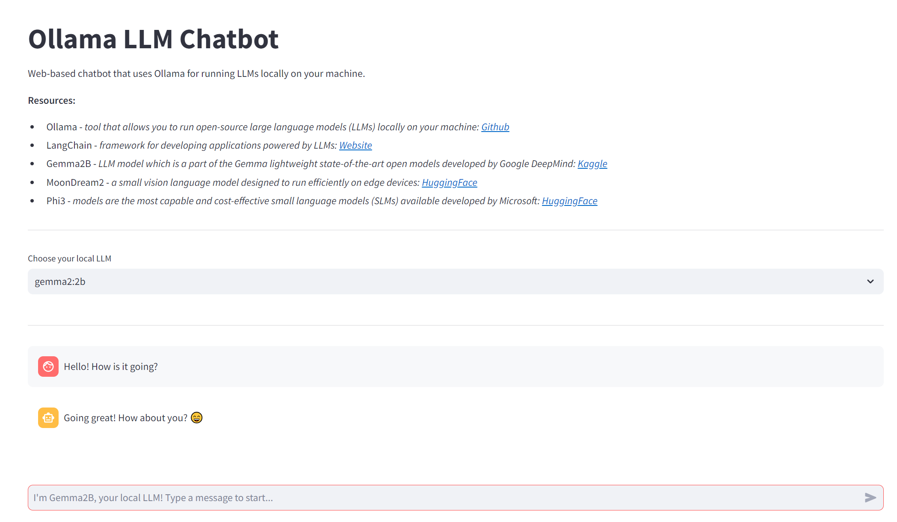

# Ollama LLM Chatbot

## Description

Web-based chatbot that uses `Ollama` for running LLMs locally on your machine.

## Tools

* **Ollama** - *tool that allows you to run open-source large language models (LLMs) locally on your machine: [Github](https://github.com/ollama/ollama)*
* **LangChain** - *framework for developing applications powered by LLMs: [Website](https://www.langchain.com/)*
* **Gemma2B** - *LLM model which is a part of the Gemma lightweight state-of-the-art open models developed by Google DeepMind: [Kaggle](https://www.kaggle.com/models/google/gemma)*
* **MoonDream2** - *a small vision language model designed to run efficiently on edge devices: [HuggingFace](https://huggingface.co/vikhyatk/moondream2)*
* **Phi3** - *models are the most capable and cost-effective small language models (SLMs) available developed by Microsoft: [HuggingFace](https://huggingface.co/docs/transformers/main/en/model_doc/phi3)*

## Date of Creation

2024-09-14

## Preview

## References

List references / resources that were useful in developing the project:

- [Streamlit Docs](https://docs.streamlit.io/)
- [Ollama Docs](https://ollama.com/)
- [LangChain Docs](https://www.langchain.com/docs/)

## Acknowledgements

- [Tech With Tim](https://www.youtube.com/@TechWithTim)